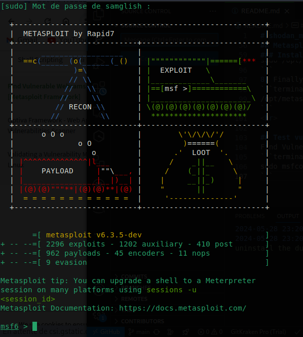
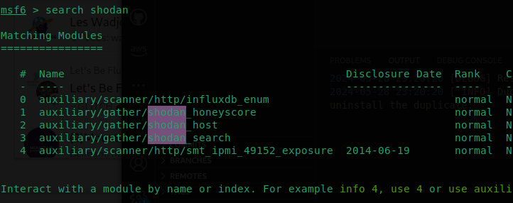

# shodan_metasploit_cli
exploit the vulnerability with Shodan in Metasploit and use Sodan in the terminal.
<hr>

## Visit shodan
<a href="https://www.shodan.io/">https://www.shodan.io/</a>
<br><br>


## Use shodan CLI
<hr>

1. Installing shodan
```terminal
pip install -U --user shodan
``` 
2. show you a list of possible sub-commands for the Shodan CLI.
```terminal
shodan
```
3. Finally, initialize the Shodan CLI with <a href="https://account.shodan.io/">your API key</a>
```
shodan init YOUR_API_KEY
```
<hr>

`Usage:` shodan [OPTIONS] COMMAND [ARGS]... </br>

`Options:` </br>
  -h, --help  Show this message and exit.
</br>

`Commands:` </br>
  
  `alert`       Manage the network alerts for your account</br> 
  `convert`     Convert the given input data file into a different format.</br>
  `count`       Returns the number of results for a search</br>
  `data`       Bulk data access to Shodan</br>
  `domain`      View all available information for a domain</br>
  `download`    Download search results and save them in a compressed JSON...</br>
  `honeyscore`  Check whether the IP is a honeypot or not.</br>
  `host`        View all available information for an IP address</br>
  `info`        Shows general information about your account</br>
  `init`        Initialize the Shodan command-line</br>
  `myip`        Print your external IP address</br>
  `org`         Manage your organization's access to Shodan</br>
  `parse`       Extract information out of compressed JSON files.</br>
  `radar`       Real-Time Map of some results as Shodan finds them.</br>
  `scan`        Scan an IP/ netblock using Shodan.</br>
  `search`      Search the Shodan database</br>
  `stats`       Provide summary information about a search query</br>
  `stream`      Stream data in real-time.</br>
  `trends`      Search Shodan historical database</br>
  `version`     Print version of this tool.</br>

## Metasploit
<hr>

### Install metasploit in linux

1. Install the prerequisites.
```terminal
sudo apt update
```
```terminal
sudo apt-get install -y ruby-dev libpq-dev libpcap-dev libsqlite3-dev postgresql git ruby-bundler build-essential patch ruby-dev zlib1g-dev liblzma-dev libgmp-dev
```
2. Create the folder to accommodate the files.
```terminal
sudo mkdir /opt/metasploit
```
3. Grant the correct permissions to the folder.
```terminal
sudo chown $USER:root -R /opt/metasploit
sudo chmod 770 -R /opt/metasploit
```
4. Clone the msf directory on github to your local folder.
```terminal
git clone https://github.com/rapid7/metasploit-framework.git /opt/metasploit
```
5. Make the files executable.
```terminal
sudo chmod +x /opt/metasploit/
```
6. Run the following command to start installing everything Ruby related.
```terminal
cd /opt/metasploit
gem install bundler -v'~>1.16'
bundle install
git config --global user.name "NAME HERE"
git config --global user.email "email@example.com"
```
7. Update metasploit.
```terminal
sudo /opt/metasploit/msfupdate
```
8. Finally launch the metasploit console.
```terminal
/opt/metasploit/msfconsole
```
<hr>

## Test vulnerability with metasploit 
Find Vulnerable Webcams with Shodan [Metasploit Framework]

```terminal
sudo msfconsole
```


```terminal
msf6 > search shodan
```


```terminal
auxiliary/gather/shodan_host 
```

```output
msf6 auxiliary(gather/shodan_search) > 
```
set your API KEY

```terminal
msf6 auxiliary(gather/shodan_search) > set SHODAN_APIKEY  Your_API_KEY
```

```terminal
msf6 auxiliary(gather/shodan_search) > set QUERY webcams
```

```terminal
msf6 auxiliary(gather/shodan_search) > exploit
```
Next, you paste that copied IP:port combo into any web browser URL bar.

<hr>

my script  `samglish_shodan.sh`
