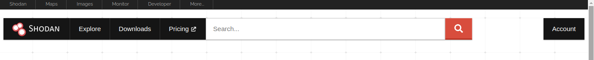

# shodan_metasploit_cli
exploit the vulnerability with Shodan in Metasploit and use Sodan in the terminal.
<hr>

## Visit shodan
<a href="https://www.shodan.io/">https://www.shodan.io/</a>
<br><br>


## Use shodan CLI
<hr>

1. Installing shodan
```terminal
pip install -U --user shodan
``` 
2. show you a list of possible sub-commands for the Shodan CLI.
```terminal
shodan
```
3. Finally, initialize the Shodan CLI with your <a href="">API key</a>
```
shodan init YOUR_API_KEY
```
